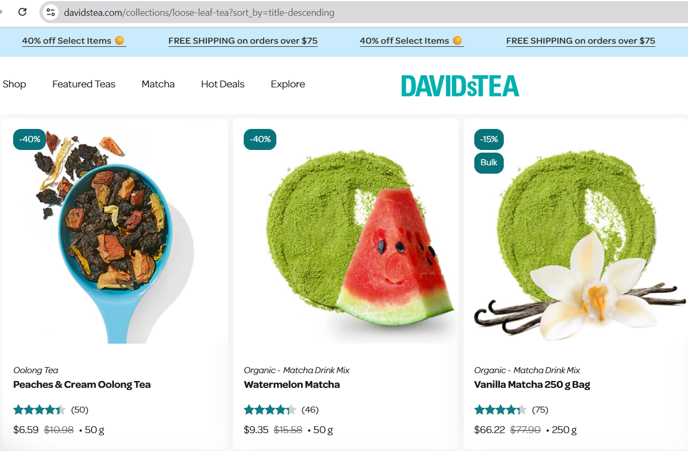

# Bug Report – Products Not Sorted Alphabetically, Z-A

**Title:** Sorting products alphabetically in descending order doesn’t sort all products  
**Reported By:** Sohjeong Yun  
**Date:** 07-04-2025  
**Severity:** Low  
**Environment:**
- Device: Laptop
- OS: Windows 11
- Browser: Chrome v137

---

## Steps to Reproduce

1. Go to https://davidstea.com/collections/loose-leaf-tea
2. Click on the "Sort by: Featured" dropdown list
3. Click on "Alphabetically, Z-A"

---

## Expected Result
- The page should show loose leaf tea products in alphabetically descending order

## Actual Result
- Some products were in alphabetically descending order, but some were not
- On page 1, "Peaches & Cream Oolong Tea" is followed by "Watermelon Matcha"

---

## Screenshot
*A screenshot of loose leaf tea products that are not sorted in alphabetically descending order:*

---

## Suggested Fix
- Add all products to the database with their correct names
- Review the code and fix any logic error on the alphabetically-descending sorting algorithm

