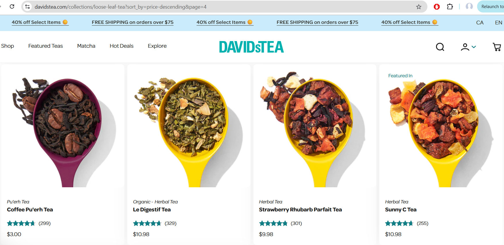

# Bug Report – Products Not Sorted By Price, From High To Low

**Title:** Sorting products by price from high to low doesn’t sort all products  
**Reported By:** Sohjeong Yun  
**Date:** 07-04-2025  
**Severity:** Low  
**Environment:**
- Device: Laptop
- OS: Windows 11
- Browser: Chrome v137

---

## Steps to Reproduce

1. Go to https://davidstea.com/collections/loose-leaf-tea
2. Click on the "Sort by: Featured" dropdown list
3. Click on "Price, high to low"

---

## Expected Result
- The page should show loose leaf tea products from high price to low price

## Actual Result
- Most products were sorted by price, from high to low, but some products were not, especially on page 4  
- For products that are on sale, the price before discount seems to be considered as the price when getting sorted

---

## Screenshot
*A screenshot of loose leaf tea products that are not sorted from high price to low price:*

---

## Suggested Fix
- Add all products to the database with their correct prices, taking the discounted prices in consideration
- Review the code and fix any logic error on the high-to-low-price sorting algorithm

