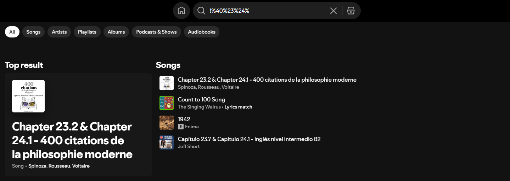

# Bug Report – Spotify Search Unexpected Behavior with Special Characters

**Title:** Certain special characters turn into their corresponding URL encoded values in the search bar  
**Reported By:** Sohjeong Yun  
**Date:** 06-25-2025  
**Severity:** Low  
**Environment:**
- Device: Desktop
- OS: Windows 10
- Browser: Chrome v137

---

## Steps to Reproduce

1. Go to https://open.spotify.com/search
2. Click on the search bar at the top of the page
3. Enter special characters such as "!@#$%"

---

## Expected Result

- Search should return no results and display a "No results found" message  

## Actual Result

- Search returned results that seemed to be irrelevant to the search input
- The search input "!@#$%" unexpectedly turned into "!%40%23%24%"
- Certain special characters turned into their corresponding URL encoded values when % was entered

---

## Screenshot

*A screenshot of the search result for "!@#$%":*

---

## Suggested Fix

- Fix the search bar behavior for special characters so that they don’t turn into their corresponding URL encoded values when % is entered

