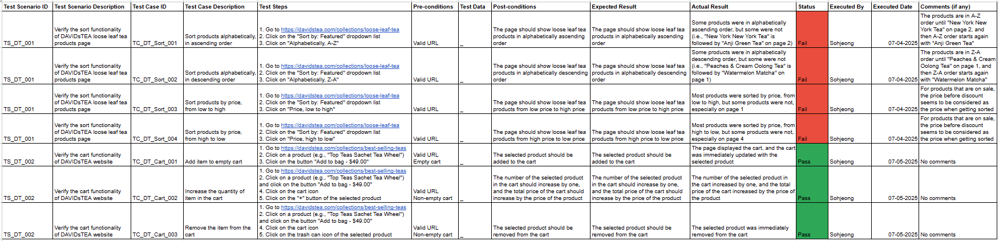
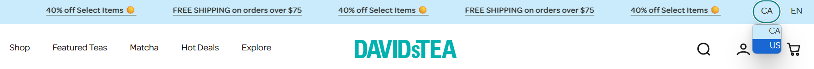
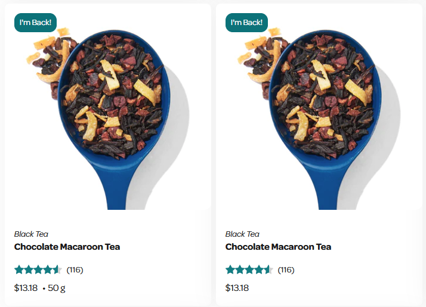
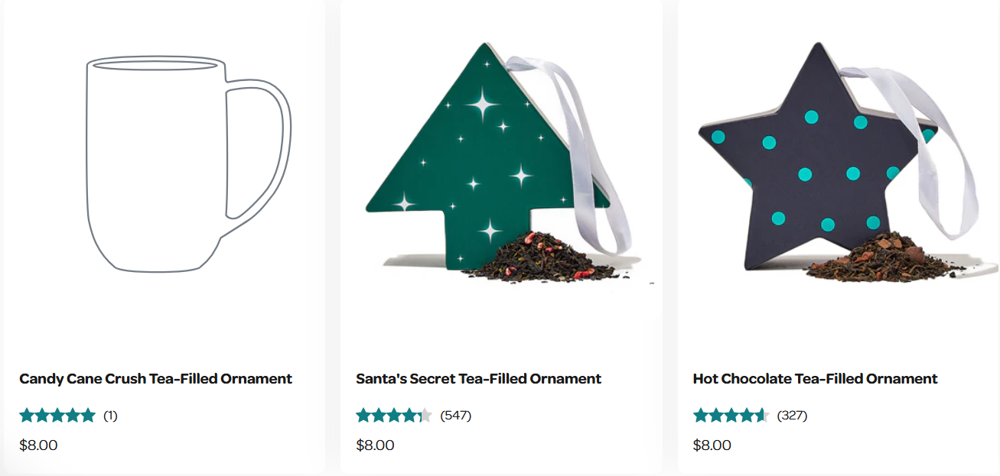

# Exploratory Testing Report – DAVIDsTEA Website

**Tester:** Sohjeong Yun  
**Date:** 07-04-2025  
**URL Tested:** https://www.davidstea.com  
**Environment:**
- Device: Laptop
- OS: Windows 11
- Browser: Chrome v137

---

## Areas Explored

- Products sorting functionality
- Product search by categories in the navigation bar
- Add to cart functionality
- Layout and design

---

## Positive Observations

- Clear categories in the navigation bar makes it easy to browse
- Cart updates immediately with accuracy
- Layout is clean
- Design is consistent with brand identity

---

## Issues or UX Concerns

- Products not sorted alphabetically, A-Z (see bug report for [TC_DT_Sort_001](../../bug_reports/davidstea_bug_report_for_TC_DT_Sort_001.md)) (see **Figure 1**)
- Products not sorted alphabetically, Z-A (see bug report for [TC_DT_Sort_002](../../bug_reports/davidstea_bug_report_for_TC_DT_Sort_002.md)) (see **Figure 1**)
- Products not sorted by price, from low to high (see bug report for [TC_DT_Sort_003](../../bug_reports/davidstea_bug_report_for_TC_DT_Sort_003.md)) (see **Figure 1**)
- Products not sorted by price, from high to low (see bug report for [TC_DT_Sort_004](../../bug_reports/davidstea_bug_report_for_TC_DT_Sort_004.md)) (see **Figure 1**)
- Country dropdown list is not aligned prettily (see **Figure 2**)
- For certain window size (i.e., my laptop), the language selection at the footer is hidden by the chat icon (see **Figure 3**)
- Two identical products with different links and almost-identical content (see **Figure 4**)
- Image not showing for the product "Candy Cane Crush Tea-Filled Ornament" (see **Figure 5**)
- Inconsistent hover functionality for different products – some show "Add to bag" on hover but some don’t

---

## Improvement Suggestions

- Add all products to the database with their correct names and correct prices, taking the discounted prices in consideration
- Review the code and fix any logic error on the alphabetically-ascending, alphabetically-descending, low-to-high-price, high-to-low-price sorting algorithms
- Make changes to the .css file so that the country dropdown list is aligned to the center
- Make changes to the .css file so that the language selection at the footer is visible for all window sizes
- Review the product detail pages and remove any duplicates
- Add image for the product "Candy Cane Crush Tea-Filled Ornament"
- Make changes to the code so that the hover functionality is consistent for all products

---

## Screenshots

**Figure 1:** A screenshot of the manual test cases written for this website

---

**Figure 2:** A screenshot of the country dropdown list at the header

---

**Figure 3:** A screenshot of the hidden language selection at the footer

---

**Figure 4:** A screenshot of two identical products with different links and almost-identical content

---

**Figure 5:** A screenshot of the product with a missing image

