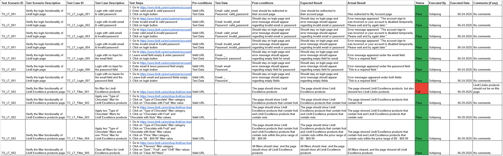

# Exploratory Testing Report – Lindt Canada Website

**Tester:** Sohjeong Yun  
**Date:** 06-29-2025  
**URL Tested:** https://www.lindt.ca/en/  
**Environment:**
- Device: Laptop
- OS: Windows 11
- Browser: Chrome v137

---

## Areas Explored

- Login functionality
- Filter functionality
- Product detail pages
- Navigation bar categories

---

## Positive Observations

- Login is intuitive and error messages are clear
- Product descriptions are clear and appealing
- Product images are high quality
- Layout is clean

---

## Issues or UX Concerns

- Lindt Excellence page shows irrelevant products (see bug report for [TC_LT_Filter_001](../../bug_reports/lindt_bug_report_for_TC_LT_Filter_001.md))
- Takes a couple of seconds for the page to load when applying or removing filters
- Confusing filter values (i.e., "Bar" vs. "Bars") for "Chocolate Format" filter category for Lindt Excellence products
- Some images for "Pick & Mix" products are misleading (i.e., the image suggests that the consumer can choose the flavor for each Lindor truffle but can actually choose only two flavors)
- Too many categories in the dropdown list of the navigation bar and some are repetitive

---

## Improvement Suggestions

- Apply changes to the Lindt database so that Lindt Lindor products do not appear on the Lindt Excellence products page
- Improve loading performance for applying and removing filters
- Review the filter values "Bar" and "Bars" for "Chocolate Format" filter category for Lindt Excellence products
- Add a description to clarify the number of flavor choices for "Pick & Mix" products, or replace the images
- Review each category in the navigation bar dropdown list and remove repetitive ones

---

## Screenshots

*A screenshot of the manual test cases written for this website:*

*A screenshot of the filter values "Bar" and "Bars" for "Chocolate Format" filter category for Lindt Excellence products:*

*A screenshot of the misleading images for some "Pick & Mix" products:*

